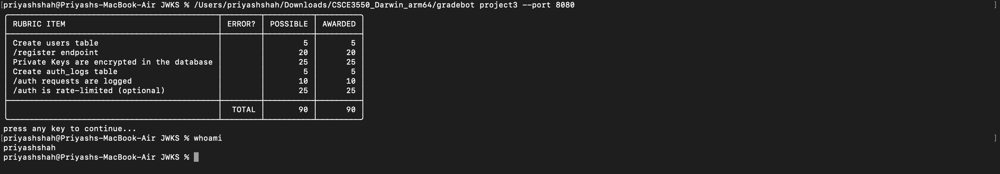
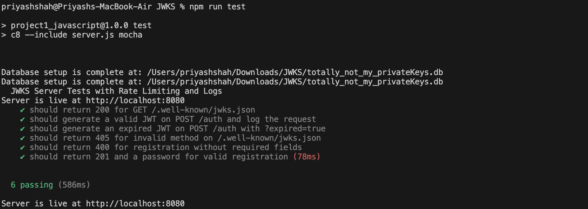

# Project 3: Bulking up our JWKS server

## Overview
This project implements a JSON Web Key Set (JWKS) server with authentication and rate limiting features. It provides:
- A secure JWKS endpoint for obtaining public keys.
- User authentication with JWT generation.
- Rate limiting to prevent abuse.
- Logging of authentication attempts.
- User registration with hashed passwords.

The server is built using:
- **Express** for handling HTTP requests.
- **SQLite** for database management.
- **jsonwebtoken** and **node-jose** for working with JWTs and JWKs.
- **argon2** for secure password hashing.
- **rate-limiter-flexible** for rate limiting.

## Features
- **Secure Key Management**: Keys are securely stored in an SQLite database with AES encryption.
- **Authentication Endpoint**: Generates JWTs with configurable expiration.
- **Rate Limiting**: Limits API requests to prevent abuse.
- **Registration Endpoint**: Allows user registration with unique usernames and emails.

## Installation
1. Clone the repository:
   ```bash
   git clone https://github.com/pr1yash/Project3JWKS.git
   cd Project3JWKS
   ```
2. Install dependencies:
   ```bash
   npm install
   ```
3. Create a `.env` file in the root directory and set the following environment variable:
   ```env
   NOT_MY_KEY=your_secret_key
   ```
4. Start the server:
   ```bash
   npm start
   ```

## Endpoints
- **GET /.well-known/jwks.json**
  - Returns the active public keys in JWKS format.

- **POST /auth**
  - Generates a JWT for the sample user.
  - Query parameter `expired=true` generates an expired JWT.

- **POST /register**
  - Registers a new user with a randomly generated password.

## Testing
Automated tests are included to verify the functionality of the server.

### Running Tests
1. Install test dependencies:
   ```bash
   npm install --save-dev mocha chai supertest c8
   ```
2. Run the tests:
   ```bash
   npm test
   ```

### Test File: `server.test.js`
This file includes tests for:
- Retrieving the JWKS.
- Authentication with and without expiration.
- Rate limiting enforcement.
- User registration validation.

## Screenshots

### Gradebot Screenshot



### Test Results Screenshot



